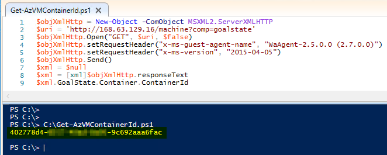

# Get-AzVMContainerId :grin:
Some PowerShell examples on how to reach out to [Azure WireServer](https://docs.microsoft.com/en-us/azure/virtual-network/what-is-ip-address-168-63-129-16) from a VM or VMSS instance to get the ContainerId from Azure platform.



### Using Invoke-RestMethod
```PowerShell
$uri = 'http://168.63.129.16/machine?comp=goalstate'
$headers = @{
    "x-ms-guest-agent-name" = "WaAgent-2.5.0.0 (2.7.0.0)"
    "x-ms-version" = "2015-04-05"
}
$xml = $null
$xml = Invoke-RestMethod -Uri $uri -Headers $headers
$xml.GoalState.Container.ContainerId
```


### Using System.Net.WebClient
```PowerShell
$uri = 'http://168.63.129.16/machine?comp=goalstate'
$wc = New-Object System.Net.WebClient 
$wc.Headers.Add("x-ms-guest-agent-name", "WaAgent-2.5.0.0 (2.7.0.0)")
$wc.Headers.Add("x-ms-version", "2015-04-05")
$xml = $null
$xml = [xml]$wc.DownloadString($uri)
$xml.GoalState.Container.ContainerId
```


### Using MSXML2.ServerXMLHTTP
```PowerShell
$objXmlHttp = New-Object -ComObject MSXML2.ServerXMLHTTP
$uri = 'http://168.63.129.16/machine?comp=goalstate'
$objXmlHttp.Open("GET", $uri, $false)
$objXmlHttp.setRequestHeader("x-ms-guest-agent-name", "WaAgent-2.5.0.0 (2.7.0.0)")
$objXmlHttp.setRequestHeader("x-ms-version", "2015-04-05")
$objXmlHttp.Send()
$xml = $null
$xml = [xml]$objXmlHttp.responseText
$xml.GoalState.Container.ContainerId
```

##### Good to know :owl:
>... _ServerXMLHTTP object depends on WinHTTP proxy settings_ ...

[ServerXMLHTTP + WinHTTP Proxy](https://docs.microsoft.com/en-us/previous-versions/windows/desktop/ms761351(v=vs.85))
